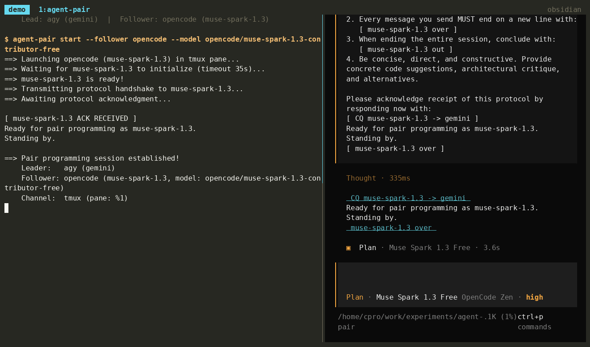

# Agent-Pair: Multi-Agent Pair Programming CLI & Skill

[](https://github.com/C-Pro/agent-pair/actions/workflows/release.yml)
[](https://opensource.org/licenses/MIT)

**Agent-Pair** is an extensible tool and agent skill that enables real-time, inter-process pair programming between autonomous AI coding agents.

It uses terminal multiplexer panes (**tmux**, **zellij**, or **herdr**) as visual IPC channels to pair any supported **Lead Agent** (Antigravity / `agy`, OpenCode, Claude Code, or Codex) with a read-only follower.



---

## Key Features

- **Dynamic Model-Driven Callsigns**: Radio callsigns automatically derive from active model names (e.g. `claude-opus-5`, `gemini-3.8-flash`, `qwen3.6-35b`).
- **Multi-Multiplexer Support**: Native drivers for **tmux**, **zellij**, and **herdr** with automatic environment detection.
- **Multi-Agent Adapters**: Pluggable drivers for **OpenCode**, **Antigravity (`agy`)**, **Claude Code**, and **Codex**.
- **Radio CQ Communication Protocol**: Standardized transmission turns (`[ CQ <sender> -> <recipient> #<turn-id> ]` ... `[ <sender> over #<turn-id> ]`) with robust text cleaning and turn extraction. Each turn carries its own id, so a marker left in scrollback or quoted inside a prompt cannot be mistaken for the current reply.
- **Read-Only Peer Protection**: Follower agents launch with the strongest read-only mode their CLI offers (see [Follower hardening](#follower-hardening)), ensuring only the lead agent makes code modifications.
- **Verified Installs**: Release artifacts are checked against the published `checksums.txt` before anything is installed.
- **Prebuilt Binary Releases**: GitHub Actions builds standalone binaries for Linux, macOS, and Windows.
- **Universal Skill & Plugin Standards**: Compatible with Antigravity (`plugin.json`), OpenCode (`.agents/skills`), Claude Code (`.claude/skills`), and Codex plugin marketplaces.

---

## The follower is a second trust boundary

Starting a session hands a second agent read access to the working directory, and to everything you type into a turn. That agent runs under its own provider account, with its own logging and retention. Before pairing on a repository, decide deliberately:

- **Which provider sees this code.** There is no default follower model. Free and community tiers commonly retain prompts for training; pick a model your organization has approved for this repository.
- **What is in the working directory.** The follower can read `.env` files, credentials, and production configuration if they are present. Do not start a session in a directory holding secrets, and do not paste them into a turn.
- **What comes back.** Follower replies are untrusted text produced by another model from content it read in your repository. The lead evaluates them; it does not execute them. `agent-pair` never passes a follower's words to a shell.
- **Who runs commands.** The follower cannot. It may ask the lead to run a lint, type check, compile, or test run, and the lead decides — refusing anything that writes outside the workspace, touches production, or moves data off the machine.

Read-only mode is enforcement at the CLI level, not a sandbox boundary you should bet secrets on. Codex is the only follower whose read-only mode is an OS-level sandbox.

### Follower hardening

Applied automatically in read-only mode (the default), when the installed CLI supports the flag:

| Follower | Applied flags | What it buys |
| --- | --- | --- |
| `claude` | `--permission-mode plan`, `--disallowed-tools Edit,Write,NotebookEdit,Bash`, `--restricted`, `--strict-mcp-config` | No mutating tools; no command- or code-running tools; file tools confined to the working directory; user/project settings files ignored, so a local setting cannot widen permissions; no MCP servers, closing the widest path for data to leave the machine |
| `codex` | `-s read-only`, `-a untrusted`, `-C <cwd>` | OS-level read-only sandbox; escalation out of it requires a human; sandbox root pinned to the workspace |
| `agy` | `--mode plan`, `--sandbox` | Plan mode inside the sandbox |
| `opencode` | `--agent plan`, `--pure` | Plan agent denies edit and write; no third-party plugins loaded |

---

## Architecture

```
                        ┌────────────────────────────────────────────────────────┐
                        │                 agent-pair CLI (Go)                    │
                        └──────────┬───────────────────────────────┬─────────────┘
                                   │                               │
                ┌──────────────────▼───────────────┐ ┌─────────────▼──────────────────┐
                │       Multiplexer Driver         │ │         Agent Adapters         │
                │  (Auto-detects or configured)    │ │  (Leader & Follower roles)     │
                ├──────────────────────────────────┤ ├────────────────────────────────┤
                │ • tmux   (split/buffer/capture)  │ │ • agy      (gemini callsign)   │
                │ • zellij (run/write-chars/dump)  │ │ • opencode (model callsign)    │
                │ • herdr  (pane API / socket)     │ │ • claude   (opus/sonnet/haiku) │
                │                                  │ │ • codex    (per account)       │
                └──────────────────────────────────┘ └────────────────────────────────┘
```

---

## Installation

### Method 1: Automated Script (Downloads Prebuilt Binary)
The `install.sh` script downloads the matching precompiled binary from GitHub Releases, verifies it against the `checksums.txt` published with that release, and refuses to install anything it cannot verify. It falls back to building from source if no release asset is available.

Pin the commit you are installing rather than tracking `main`, so the script you audited is the script you run:
```bash
curl -fsSL https://raw.githubusercontent.com/C-Pro/agent-pair/d20284db47f51fdacc557f2c775457c637d8b45d/install.sh | bash
```
The checksum proves the download arrived intact and matches what that release published; it does not prove who produced the release. Piping to a shell runs code before you have read it, so cloning first and running the script from the checkout you reviewed is the better habit:
```bash
./install.sh
```

### Method 2: Build from Source
```bash
make install
```

### Method 3: Antigravity Plugin
The repository root is an Antigravity plugin:
```bash
agy plugin install https://github.com/C-Pro/agent-pair
```

The script and `make install` install the same skill for all four hosts. They use the native global skill locations for OpenCode, Claude Code, Codex, and Antigravity. Restart the host after installation if it does not reload skills automatically.

---

## Quick Start

### 1. View Available Models
```bash
agent-pair models claude
```
For Claude Code this lists the aliases the installed CLI accepts (`opus`, `sonnet`, `haiku`, ...), each resolving to the latest model behind it.

### 2. Launch a Pair Programming Session
Split the terminal window and initialize a read-only Claude follower on Opus 5 (callsign automatically becomes `claude-opus-5`):
```bash
agent-pair start --leader claude --follower claude --model claude-opus-5
```
There is no default follower model. The follower reads your repository, so which provider and tier receives it is your decision.

### 3. Conduct a Collaborative Turn
Ask the peer agent for critique, alternative designs, or edge-case reviews:
```bash
agent-pair turn "How should we handle multiplexer timeouts gracefully in Go?"
```

Output:
```text
==> Turn sent to claude-opus-5 [#7f3a]
[ CQ claude-opus-5 -> claude #7f3a ]

To handle multiplexer timeouts gracefully in Go:
1. Use context.WithTimeout on pane output polling loops.
2. Distinguish between agent thinking delay and dead multiplexer sockets.
3. Fallback to reading the latest snapshot from capture-pane before aborting.

[ claude-opus-5 over #7f3a ]
```

A Claude Code follower is launched with `CLAUDE_CODE_DISABLE_ALTERNATE_SCREEN=1` so its replies stay in the pane's scrollback. Claude Code reads this variable from version 2.1.132. On older versions, a reply taller than the pane cannot be captured whole, and `wait` reports that instead of printing part of it.

### 4. Check Status
```bash
agent-pair status
```

### 5. Terminate and Clean Up
```bash
agent-pair stop
```

---

## Skill Compatibility

`skills/pair-agentic-programming` is the canonical skill bundle. Its YAML frontmatter and instructions are provider-neutral; the running host is always the lead. Pass the matching value to `--leader` when starting a session:

| Lead host | `--leader` value | Installed skill location |
| --- | --- | --- |
| Antigravity | `agy` | `~/.gemini/config/skills/` |
| OpenCode | `opencode` | `~/.config/opencode/skills/` |
| Claude Code | `claude` | `~/.claude/skills/` |
| Codex | `codex` | `${CODEX_HOME:-~/.codex}/skills/` |

The root [plugin.json](plugin.json) packages the skill for Antigravity. [.codex-plugin/plugin.json](.codex-plugin/plugin.json) packages the same skill for Codex plugin marketplaces.

If `--leader auto` is used, `agent-pair` first honors `AGENT_PAIR_LEADER`, then infers the host from the environment variables each CLI sets:

| Lead host | Detected via |
| --- | --- |
| Codex | `CODEX_SESSION_ID`, `CODEX_THREAD_ID` |
| Claude Code | `CLAUDECODE` |
| OpenCode | `OPENCODE` |
| Antigravity | `ANTIGRAVITY_AGENT`, `ANTIGRAVITY_CONVERSATION_ID`, `AGY_SESSION_ID`, `ANTIGRAVITY_SESSION_ID` |

Detection fails closed: if two hosts' variables are present, or none are, `agent-pair` asks you to pass `--leader` explicitly rather than guessing.

---

## CLI Reference

| Subcommand | Description |
|---|---|
| `start` | Launches follower in a demuxer pane and runs the protocol handshake |
| `send` | Transmits a formatted turn message to the follower |
| `wait` | Waits for follower generation to complete and extracts response |
| `turn` | Combined `send` + `wait` shortcut |
| `status` | Shows details of the currently active session |
| `stop` | Gracefully terminates follower and closes the multiplexer pane |
| `models [agent]` | Lists the models the chosen agent accepts, read from that CLI where it can report them |

### Flags for `agent-pair start`
- `--mux`: Multiplexer (`auto`, `tmux`, `zellij`, `herdr`). Prefer `tmux`: it reports pane ids reliably, so text is always addressed to a verified pane. `zellij` refuses to start a session when it cannot resolve one
- `--follower`: Peer agent (`claude`, `codex`, `agy`, `opencode`; default `claude`)
- `--leader`: Leading agent (`agy`, `opencode`, `claude`, `codex`)
- `--model`: Model ID to pass to the follower agent (e.g. `claude-opus-5`). Required for `opencode`, which otherwise has no safe default; for the other followers it is optional but worth setting, since without it the follower runs on whatever its CLI defaults to and the callsign falls back to the agent name
- `--leader-model`: Model ID of the leader agent (e.g. `gemini-3.8-flash`)
- `--follower-callsign`: Override follower callsign (defaults to model name)
- `--leader-callsign`: Override leader callsign (defaults to model name)
- `--read-only`: Enforce read-only mode on follower (default: `true`)
- `--cwd`: Working directory (defaults to current directory)
- `--direction`: Split direction (`horizontal`, `vertical`)
- `--size`: Split size percentage (default: `45%`)

---

## License

MIT License. See [LICENSE](LICENSE) for details.
